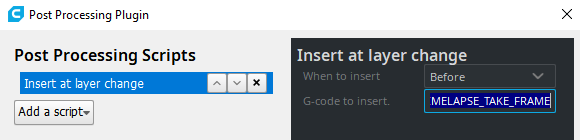

#
This document describes Moonraker's full configuration.  As this file
references configuration for both Klipper (`printer.cfg`) and Moonraker
(`moonraker.conf`), each example contains a commment indicating which
configuration file is being refrenenced. A basic
[sample configuration](./moonraker.conf) in the `docs` directory.

## `[server]`

The `[server]` section provides essential configuration for Moonraker
and its core components.  This section is requrired.

```ini

# moonraker.conf

[server]
host: 0.0.0.0
#  The host address in which to bind the HTTP server.  Default is to bind
#  to all interfaces
port: 7125
#   The port the HTTP server will listen on.  Default is 7125
klippy_uds_address: /tmp/klippy_uds
#   The address of Unix Domain Socket used to communicate with Klippy. Default
#   is /tmp/klippy_uds
max_upload_size: 1024
#   The maximum size allowed for a file upload (in MiB).  Default is 1024 MiB.
enable_debug_logging: False
#   When set to True Moonraker will log in verbose mode.  During this stage
#   of development the default is False.
config_path:
#   The path to a directory where configuration files are located. This
#   directory may contain Klipper config files (printer.cfg) or Moonraker
#   config files (moonraker.conf).  Clients may also write their own config
#   files to this directory.  Note that this may not be the system root
#   (ie: "/") and moonraker must have read and write access permissions
#   for this directory.
database_path: ~/.moonraker_database
#   The path to the folder that stores Moonraker's lmdb database files.
#   It is NOT recommended to place this file in a location that is served by
#   Moonraker (such as the "config_path" or the location where gcode
#   files are stored).  If the folder does not exist an attempt will be made
#   to create it.  The default is ~/.moonraker_database.
temperature_store_size: 1200
#   The maximum number of temperature values to store for each sensor. Note
#   that this value also applies to the "target", "power", and "fan_speed"
#   if the sensor reports them.  The default is 1200, which is enough to
#   store approximately 20 minutes of data at one value per second.
gcode_store_size:  1000
#   The maximum number "gcode lines" to store.  The default is 1000.
```
## `[authorization]`

The `[authorization]` section provides configuration for Moonraker's
authorization module. This section is required.

```ini
# moonraker.conf

[authorization]
enabled: True
#   Enables authorization.  When set to true, requests must either contain
#   a valid API key or originate from a trusted client. Default is True.
api_key_file: ~/.moonraker_api_key
#   Path of the file that stores Moonraker's API key.  The default is
#   ~/.moonraker_api_key
trusted_clients:
 192.168.1.30
 192.168.1.0/24
#   A list of newline separated ip addresses and/or ip ranges that are
#   trusted. Trusted clients are given full access to the API.  Both IPv4
#   and IPv6 addresses and ranges are supported. Ranges must be expressed
#   in CIDR notation (see http://ip.sb/cidr for more info).  For example, an
#   entry of 192.168.1.0/24 will authorize IPs in the range of 192.168.1.1 -
#   192.168.1.254.  Note that when specifying IPv4 ranges the last segment
#   of the ip address must be 0. The default is no clients or ranges are
#   trusted.
cors_domains:
  http://klipper-printer.local
  http://second-printer.local:7125
#   Enables CORS for the specified domains.  One may specify * if they wish
#   to allow all domains, however this should be an option reserved for
#   client developers and not used in production.  A * can also be used
#   to specify a wildcard that matches several domains.  For example:
#     *.local
#     http://*.my-domain.com
#     *.my-domain.com:*
#   Are all valid entries.  However, a wildcard may not be specified in
#   the top level domain:
#      http://my-printer.*
#   The above example will be rejected.
#   When CORS is enabled by adding an entry to this option, all origins
#   matching the "trusted_clients" option will have CORS headers set as
#   well.  If this option is not specified then CORS is disabled.
```

## `[octoprint_compat]`
Enables partial support of Octoprint API is implemented with the purpose of
allowing uploading of sliced prints to a moonraker instance.
Currently we support Slic3r derivatives and Cura with Cura-Octoprint.

```ini
# moonraker.conf

[octoprint_compat]
```

## `[history]`
Enables print history tracking.

```ini
# moonraker.conf

[history]
```

## `[paneldue]`
Enables PanelDue display support.  The PanelDue should be connected to the
host machine, either via the machine's UART GPIOs or through a USB-TTL
converter.  Currently PanelDue Firmware Version 1.24 is supported.  Other
releases may not behave correctly.

```ini
# moonraker.conf

[paneldue]
serial:
#   The serial port in which the PanelDue is connected.  This parameter
#   must be provided.
baud: 57600
#   The baud rate to connect at.  The default is 57600 baud.
machine_name: Klipper
#   An optional unique machine name which displays on the PanelDue's
#   Header.  The default is "Klipper".
macros:
 LOAD_FILAMENT
 UNLOAD_FILAMENT
 PANELDUE_BEEP FREQUENCY=500 DURATION=1
#   A list of newline separated "macros" that are displayed in the
#   PanelDue's "macros" tab.  These can be gcode macros or simple
#   gcodes.  A macro may contain parameters.  The default is no
#   macros will be displayed by the PanelDue.
confirmed_macros:
  RESTART
  FIRMWARE_RESTART
#  Like the "macros" option, this list is added to the macros tab.
#  When one of these macros is excuted the PanelDue will prompt
#  the user with a confirmation dialog.  The default is to include
#  RESTART and FIRMWARE_RESTART.
```

Most options above are self explanatory.  The "macros" option can be used
to specify commands (either built in or gcode_macros) that will show up
in the PanelDue's "macro" menu.

Note that buzzing the piezo requires the following gcode_macro in `printer.cfg`:
```ini
# printer.cfg

[gcode_macro PANELDUE_BEEP]
# Beep frequency
default_parameter_FREQUENCY: 300
# Beep duration in seconds
default_parameter_DURATION: 1.
gcode:
  {action_call_remote_method("paneldue_beep",
                             frequency=FREQUENCY|int,
                             duration=DURATION|float)}
```

## `[power]`
Enables device power control.  Currently GPIO (relays), TPLink Smartplug,
and Tasmota (via http) devices are supported.

```ini
# moonraker.conf

[power device_name]
type: gpio
#   The type of device.  Can be either gpio, tplink_smartplug, tasmota
#   or homeseer.
#   This parameter must be provided.
off_when_shutdown: False
#   If set to True the device will be powered off when Klipper enters
#   the "shutdown" state.  This option applies to all device types.
#   The default is False.
locked_while_printing: False
#   If True, locks the device so that the power cannot be changed while the
#   printer is printing. This is useful to avert an accidental shutdown to
#   the printer's power.  The default is False.
restart_klipper_when_powered: False
#   If set to True, Moonraker will issue a "FIRMWARE_RESTART" to Klipper
#   after the device has been powered on.  The default is False, thus no
#   attempt to made to restart Klipper after power on.
restart_delay: 1.
#   If "restart_klipper_when_powered" is set, this option specifies the amount
#   of time (in seconds) to delay the restart.  Default is 1 second.
pin: gpiochip0/gpio26
#   The pin to use for GPIO devices.  The chip is optional, if left out
#   then the module will default to gpiochip0.  If one wishes to invert
#   the signal, a "!" may be prefixed to the pin.  Valid examples:
#      gpiochip0/gpio26
#      gpio26
#      !gpiochip0/gpio26
#      !gpio26
#    This parameter must be provided for "gpio" type devices
initial_state: off
#    The initial state for GPIO type devices.  May be on or
#    off.  When moonraker starts the device will be set to this
#    state.  Default is off.
address:
port:
#   The above options are used for "tplink_smartplug" devices.  The
#   address should be a valid ip or hostname for the tplink device.
#   The port should be the port the device is configured to use.  The
#   address must be provided. The port defaults to 9999.
address:
password:
output_id:
#   The above options are used for "tasmota" devices.  The
#   address should be a valid ip or hostname for the tasmota device.
#   Provide a password if configured in Tasmota (default is empty).
#   Provided an output_id (relay id) if the Tasmota device supports
#   more than one (default is 1).
#   If your single-relay Tasmota device switches on/off successfully,
#   but fails to report its state, ensure that 'SetOption26' is set in
#   Tasmota.
address:
user:
password:
output_id:
#   The above options are used for "shelly" devices.  The
#   address should be a valid ip or hostname for the Shelly device.
#   Provide a user and password if configured in Shelly (default is empty).
#   If password is set but user is empty the default user "admin" will be used
#   Provided an output_id (relay id) if the Shelly device supports
#   more than one (default is 0).
address:
device:
user:
password:
#   The above options are used for "homeseer" devices.  The
#   address should be a valid ip or hostname for the homeseer controller.
#   "device" should be the ID of the device to control.
#   To find out the ID, in the HomeSeer UI, click on the device you want to
#   control (Make sure to click the sub-device that actually has On/Off
#   buttons).  And then go to the "status/graphics" tab and it should list
#   "ID" in the "advanced information" section.
#   Provide a user and password with access to "device control"
#   and at least the specific device you want to control

```
Below are some potential examples:
```ini
# moonraker.conf

[power printer]
type: gpio
pin: gpio26
off_when_shutdown: True
initial_state: off

[power printer_led]
type: gpio
pin: !gpiochip0/gpio16
initial_state: off

[power light_strip]
type: gpio
pin: gpiochip0/gpio17
initial_state: on

[power wifi_switch]
type: tplink_smartplug
address: 192.168.1.123

[power tasmota_plug]
type: tasmota
address: 192.168.1.124
password: password1

[power shelly_plug]
type: shelly
address: 192.168.1.125
user: user2
password: password2
```

It is possible to toggle device power from the Klippy host, this can be done
with a gcode_macro, such as:
```ini
# printer.cfg

[gcode_macro POWER_OFF_PRINTER]
gcode:
  {action_call_remote_method("set_device_power",
                             device="printer",
                             state="off")}
```
The `POWER_OFF_PRINTER` gcode can be run to turn off the "printer" device.
This could be used in conjunction with Klipper's idle timeout to turn the
printer off when idle with a configuration similar to that of below:
```ini
# printer.cfg

[delayed_gcode delayed_printer_off]
initial_duration: 0.
gcode:
  
    POWER_OFF_PRINTER
  

[idle_timeout]
gcode:
  TURN_OFF_MOTORS
  TURN_OFF_HEATERS
  UPDATE_DELAYED_GCODE ID=delayed_printer_off DURATION=60
```

## `[update_manager]`
This enables moonraker's update manager.  Note that updates can only be
performed on pristine git repos.  Repos that have been modified on
disk or cloned from unofficial sources are not supported.

```ini
# moonraker.conf

[update_manager]
enable_repo_debug: False
#   When set to True moonraker will bypass repo validation and allow
#   updates from unofficial remotes and/or branches.  Updates on
#   detached repos are also allowed.  This option is intended for
#   developers and should not be used on production machines.  The
#   default is False.
enable_auto_refresh: False
#   When set to True Moonraker will attempt to fetch status about
#   available updates roughly every 24 hours, between 12am-4am.
#   When set to False Moonraker will only fetch update state on startup
#   and clients will need to request that Moonraker updates state.  The
#   default is False.
distro: debian
#   The disto in which moonraker has been installed.  Currently the
#   update manager only supports "debian", which encompasses all of
#   its derivatives.  The default is debain.
```

### Client Configuration
This allows client programs such as Fluidd, KlipperScreen, and Mainsail to be
updated in addition to klipper, moonraker, and the system os. Repos that have
been modified or cloned from unofficial sources are not supported.

There are two types of update manager clients and each will be detailed
separately. The first one is targeted towards releases that do not need a
service restart such as Fluidd/Mainsail.

```ini
# moonraker.conf

[update_manager client client_name]
type: web
repo:
#   This is the GitHub repo of the client, in the format of user/client.
#   For example, this could be set to cadriel/fluidd to update Fluidd or
#   meteyou/mainsail to update Mainsail.  This parameter must be provided.
path:
#   The path to the client's files on disk.  This parameter must be provided.
persistent_files:
#   A list of newline separated file names that should persist between
#   updates.  This is useful for static configuration files, or perhaps
#   themes.  The default is no persistent files.
```

This second example is for git repositories that have a service that need
updating.

```ini
# moonraker.conf

# service_name must be the name of the systemd service
[update_manager client service_name]
type: git_repo
path:
#   The absolute path to the client's files on disk. This parameter must be provided.
#   Example:
#     path: ~/service_name
origin:
#   The full GitHub URL of the "origin" remote for the repository.  This can
#   be be viewed by navigating to your repository and running:
#     git remote -v
#   This parameter must be provided.
primary_branch:
#   The name of the primary branch used for release code on this repo.  This
#   option allows clients to specify 'main', or their own unique name, as
#   the branch used for repo validity checks.  The default is master.
env:
#   The path to the client's virtual environment executable on disk.  For
#   example, Moonraker's venv is located at ~/moonraker-env/bin/python.
#   The default is no env, which disables updating python packages.
requirements:
#  This is the location in the repository to the client's virtual environment
#  requirements file. This location is relative to the root of the repository.
#  This parameter must be provided if the "env" option is set, otherwise it
#  should be omitted.
install_script:
#  The file location, relative to the repository, for the installation script.
#  The update manager parses this file for "system" packages that need updating.
#  The default is no install script, which disables system package updates
```

## `[Timelapse]`
Generate Timelapse of a Print

This Plugin depends on FFMPEG and mjpegstreamer installed on the System which
is preinstalled in MainsailOs and FluidPI.
If not you can install it manually using this Guide:
https://github.com/cncjs/cncjs/wiki/Setup-Guide:-Raspberry-Pi-%7C-MJPEG-Streamer-Install-&-Setup-&-FFMpeg-Recording#mjpeg-streamer-install--setup

You may want to change your Webcamstream to higher resolution, 
depeding on your OS the mpjepg-streamer config file location differ:   
- MainsailOS: /boot/mainsail.txt   
- FluiddPI: 	/boot/fluiddpi.txt   

NOTE:   /boot is owned by root and can not editet as pi user!
        To edit it use ``sudo nano /boot/mainsail.txt`` via ssh
        or plug your sd card into your pc and edit it there.  

    
mjpeg-streamer options see:    
https://github.com/jacksonliam/mjpg-streamer/blob/master/mjpg-streamer-experimental/plugins/input_uvc/README.md


### Activate and configure the plugin adding following to your moonraker.conf:
```ini
# moonraker.conf

[timelapse]
#enabled: True
##   If this set to False the Gcode macros are ignored and
##   the autorender is disabled at the end of the print.
##   The idea is to disable the plugin by default and only activate 
##   it during runtime via the http endpoint if a timelapse is desired.
#autorender: True
##   If this is set to False, the autorender is disabled at the end of the print.
#constant_rate_factor: 23
##   The range of the CRF scale is 0–51, where 0 is lossless,
##   23 is the default, and 51 is worst quality possible. 
##   A lower value generally leads to higher quality, and a 
##   subjectively sane range is 17–28.
##   more info: https://trac.ffmpeg.org/wiki/Encode/H.264
#output_framerate: 30
##   Output framerate of the generated video
#output_path: ~/timelapse/
##   Path where the generated video will be saved
#frame_path: /tmp/timelapse/
##   Path where the temporary frames are saved
#time_format_code: %Y%m%d_%H%M
##   Manipulates datetime format of the output filename
##   see: https://docs.python.org/3/library/datetime.html#strftime-and-strptime-format-codes
#snapshoturl: http://localhost:8080/?action=snapshot
##   url to your webcamstream
#pixelformat: yuv420p
##   set pixelformat for output video
##   default to yuv420p because eg. yuvj422p will not play on 
##   on most smartphones or older media players
#extraoutputparams: 
##   here you can extra output parameters to FFMPEG 
##   further info: https://ffmpeg.org/ffmpeg.html 
##   eg rotate video by 180° "-vf transpose=2,transpose=2"
##   or repeat last frame for 5 seconds:
##   -filter_complex "[0]trim=0:5[hold];[0][hold]concat[extended];[extended][0]overlay"
```

### Define the Gcode Macro:
Add the macro to your printer.cfg
```ini
# printer.cfg

[gcode_macro TIMELAPSE_TAKE_FRAME]
gcode:
 {action_call_remote_method("timelapse_newframe")}
```
Note: You can add extra gcode to the macro if you like to move your
printhead to a specific position, before taking a picture.

### Add the macro to your Slicer:
Add the ``TIMELAPSE_TAKE_FRAME`` macro to your slicer so that it is added to the Gcode before or after a layer change.

Note: Also add the macro to your End G-code to get a extra "finished print"
frame.

#### Prusa Slicer
Printer Settings -> Custom G-code -> Before layer change Gcode -> ``TIMELAPSE_TAKE_FRAME``


#### Ultimaker Cura
Extensions -> Post Processing -> Modify G-Code ->   
Add a script -> Insert at layer change -> G-code to insert = ``TIMELAPSE_TAKE_FRAME``


